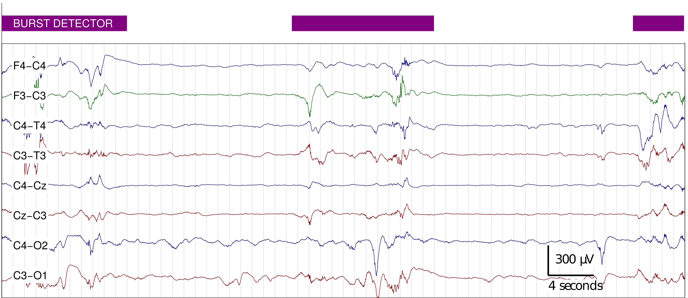
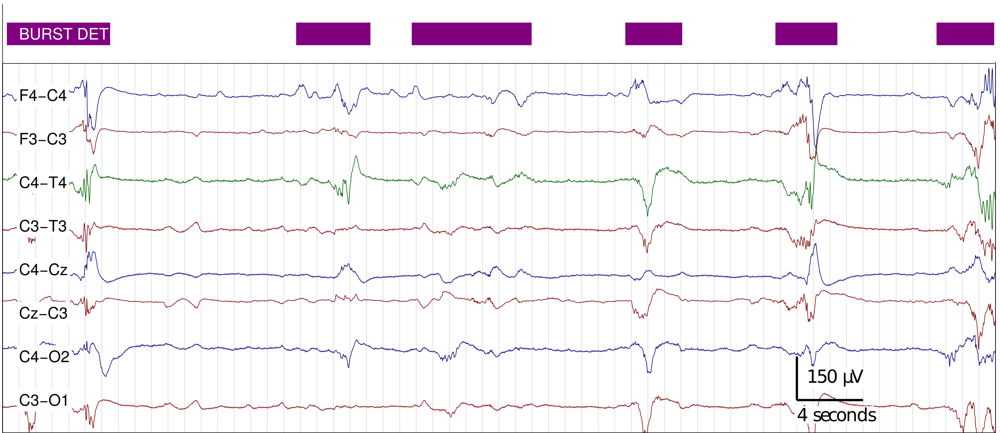
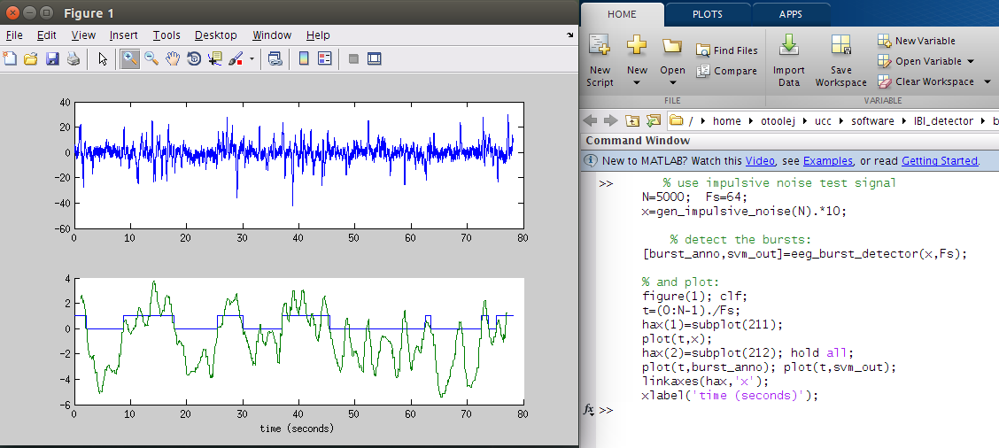

Burst Detector for Preterm EEG
==============================

Collection of M-files (computer code) to implement a method to detect bursts on EEG
recordings, as described in [[1]](#references). Detector uses a linear combination of
multiple amplitude and spectral features.  Developed and tested on EEG recordings from
premature infants (<30 weeks gestational age) using a bipolar EEG montgage (F3-C3, F4-C4,
C3-O1, C4-O2, C3-T3, C4-T4, Cz-C3, and C4-Cz). Detector operates on 1 channel only.
Requires Python 3 with with NumPy, SciPy, Matlablib, and Dataclasses packages. 

To cite this software, please use reference [[1]](#references). 

Python version of the [Matlab code](https://github.com/otoolej/burst_detector), also on github.


# contents
[overview](#overview) | [requirements](#requirements) | [quick start](#quick-start) |
[example](#example) | [licence](LICENCE.md) | [references](#references) | [contact](#contact)


# overview



A simple method to detect bursts in the EEG of preterm infants. The method was developed
by assessing multiple frequency and amplitude features of bursts. Selected features were combined in
a classifier (support vector machine). After a feature selection and training procedure,
the detector consisted of eight features which are combined in a linear support vector
machine. The code here implements this detector, which was trained on annotations from
1-channel of 10 minute EEG recordings from 36 preterm infants.




# requirements
Developed and tested with Python 3.7. Requires:
+ NumPy (developed with version 1.17.0)
+ SciPy (developed with version 1.3.0)
+ Matplotlib (developed with version 3.1.1)
+ Dataclasses (developed with version 0.6)


# quick start
Set paths in Matlab/Octave, or do so using the `load_curdir` function:
```matlab
  >> load_curdir;
```


# example
```matlab
      % use impulsive noise test signal
      N=5000;  Fs=64; 
      x=gen_impulsive_noise(N).*10;
      
	  % detect the bursts:
      [burst_anno,svm_out]=eeg_burst_detector(x,Fs);

      % and plot:
      figure(1); clf; 
      t=(0:N-1)./Fs;
      hax(1)=subplot(211); hold all;
      plot(t,burst_anno); plot(t,svm_out);
      hax(2)=subplot(212); 
      plot(t,x);
      linkaxes(hax,'x');
      xlabel('time (seconds)');
```



# files
All Matlab files (.m files) have a description and an example in the header. To read this
header, type `help <filename.m>` in Matlab.  Directory structure is as follows: 
```
├── burst_detector
│   ├── eeg_burst_detector.py
│   ├── bd_parameters.py
│   ├── feature_set.py
│   └── utils.py
├── data
│   └── ellip_filt_coeffs.npz
├── pics
│   ├── burst_detector_impulsive_noise_example.png
│   ├── detector_example_for_website.png
│   └── detector_example_for_website_v2.png
├── requirements.txt
├── LICENSE.md
└── README.md
```


---


# references

1. JM O' Toole, GB Boylan, RO Lloyd, RM Goulding, S Vanhatalo, and NJ Stevenson,
“Detecting Bursts in the EEG of Very and Extremely Premature Infants Using a Multi-Feature
Approach”, Medical Engineering & Physics, vol. 45, pp. 42-50, 2017. 
[DOI:10.1016/j.medengphy.2017.04.003](https://doi.org/10.1016/j.medengphy.2017.04.003)
(Version of the Matlab code to accompany paper: 
[](https://zenodo.org/badge/latestdoi/42042482))


2. JM O' Toole and NJ Stevenson, “Assessing instantaneous energy in the EEG: a
non-negative, frequency-weighted energy operator”, In 36th Annual International Conference
of the IEEE Engineering in Medicine and Biology Society (EMBC), pp. 3288-3291, 2014. 
{ [paper](http://otoolej.github.io/pubs/PDFs/JMOToole_energy_EMBC14.pdf) |
  [poster](http://otoolej.github.io/pubs/PDFs/EMBC_poster_Aug2014_NLEO.pdf) |
  [code (Matlab)](https://github.com/otoolej/nonlinear-energy-operators/)
  [code (Python)](https://github.com/otoolej/envelope_derivative_operator)}


---

# contact

John M. O' Toole

Neonatal Brain Research Group,  
INFANT Research Centre ([INFANT](http://www.infantcentre.ie/)),  
Department of Paediatrics and Child Health,  
University College Cork,  
Cork University Hospital, Room 2.19 Paediatrics Building,  
Cork, Ireland


