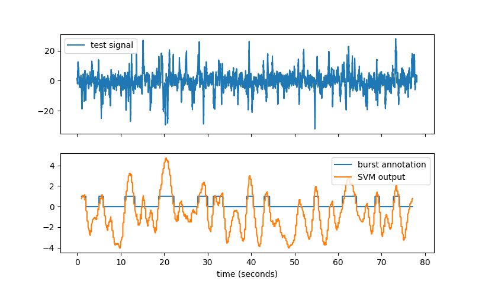

Burst Detector for Preterm EEG
==============================

Collection of M-files (computer code) to implement a method to detect bursts on EEG
recordings, as described in [[1]](#references). Detector uses a linear combination of
multiple amplitude and spectral features.  Developed and tested on EEG recordings from
premature infants (<30 weeks gestational age) using a bipolar EEG montgage (F3-C3, F4-C4,
C3-O1, C4-O2, C3-T3, C4-T4, Cz-C3, and C4-Cz). Detector operates on 1 channel only.

Requires Python 3 with with NumPy, SciPy, Matlablib, and Dataclasses packages. 

To cite this software, please use reference [[1]](#references). 

Python version of the [Matlab code](https://github.com/otoolej/burst_detector).


[Overview](#Overview) | [Requirements](#Requirements) | [Example](#Example) |
[Licence](LICENCE.md) | [References](#References) | [Contact](#Contact)


# Overview


A simple method to detect bursts in the EEG of preterm infants. The method was developed
by assessing multiple frequency and amplitude features of bursts. Selected features were combined in
a classifier (support vector machine). After a feature selection and training procedure,
the detector consisted of eight features which are combined in a linear support vector
machine. The code here implements this detector, which was trained on annotations from
1-channel of 10 minute EEG recordings from 36 preterm infants.


# Requirements
Developed and tested with Python 3.7. Requires:
+ NumPy (developed with version 1.17.0)
+ SciPy (developed with version 1.3.0)
+ Matplotlib (developed with version 3.1.1)
+ Dataclasses (developed with version 0.6)
+ Numba (developed with version 0.46.0)


# Example
Generate a test signal:
```python
from burst_detector import eeg_burst_detector, utils

N = 5000
Fs = 64
x = utils.gen_impulsive_noise(N)
```
then run the burst detector:
```python
burst_anno, svm_out = eeg_burst_detector.eeg_bursts(x, Fs)
```



# Files
All Matlab files (.m files) have a description and an example in the header. To read this
header, type `help <filename.m>` in Matlab.  Directory structure is as follows: 
```
├── burst_detector                         # burst detector PACKAGE:
│   ├── eeg_burst_detector.py              # main module
│   ├── bd_parameters.py                   # parameters for detector
│   ├── feature_set.py                     # generates the features
│   └── utils.py                           # miscellaneous functions
├── data
│   └── ellip_filt_coeffs.npz              # filter coefficients 
├── pics                                   # images used in this readme
│   ├── burst_detector_impulsive_noise_example.png
│   ├── detector_example_for_website.png
│   └── detector_example_for_website_v2.png
├── demo.py                                # run the burst detector with a test signal
├── requirements.txt
├── LICENSE.md
└── README.md
```


---

# References

1. JM O' Toole, GB Boylan, RO Lloyd, RM Goulding, S Vanhatalo, and NJ Stevenson,
“Detecting Bursts in the EEG of Very and Extremely Premature Infants Using a Multi-Feature
Approach”, Medical Engineering & Physics, vol. 45, pp. 42-50, 2017. 
[DOI:10.1016/j.medengphy.2017.04.003](https://doi.org/10.1016/j.medengphy.2017.04.003)


2. JM O' Toole and NJ Stevenson, “Assessing instantaneous energy in the EEG: a
non-negative, frequency-weighted energy operator”, In 36th Annual International Conference
of the IEEE Engineering in Medicine and Biology Society (EMBC), pp. 3288-3291, 2014. 
{ [paper](http://otoolej.github.io/pubs/PDFs/JMOToole_energy_EMBC14.pdf) |
  [poster](http://otoolej.github.io/pubs/PDFs/EMBC_poster_Aug2014_NLEO.pdf) |
  [code (Matlab)](https://github.com/otoolej/nonlinear-energy-operators/),
  [code (Python)](https://github.com/otoolej/envelope_derivative_operator)}


---

# Contact

John M. O' Toole

Neonatal Brain Research Group,  
[INFANT Research Centre](http://www.infantcentre.ie/),  
Department of Paediatrics and Child Health,  
University College Cork,  
Cork University Hospital, Room 2.19 Paediatrics Building,  
Cork, Ireland


